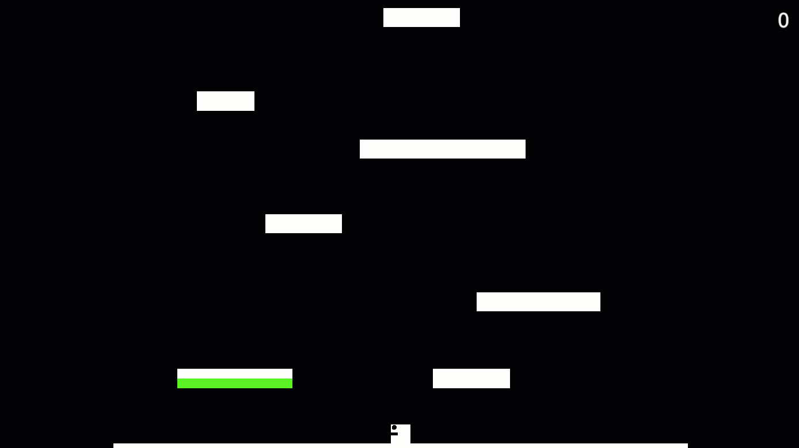

<h1 align="center">Game Dev Summer Course</h1>
<h3 align="center">Hi! I am Laura Oprisan and these are my prototypes for the rapid development track</h3>

<table bordercolor="#66b2b2">

<!--second row -->
  <tr>
            <td width="50%" valign="top">
      <h3 align="center">Bathhouse Management</h3>
         
        
         
        

<strong>Prototype #4</strong>

</td>
      <td width="50%" valign="top">
      <h3 align="center">DoodleKongWell</h3>
         
        
         
        

<strong>Prototype #3</strong>

</td>

</tr>

<!--second row -->
  <tr>
          <td width="50%" valign="top">
      <h3 align="center">Sugar tower defense</h3>
         
        
         
        

<strong>Prototype #2</strong>

</td>
  <td width="50%" valign="top">
    <h3 align="center">Infinite Runner</h3>
         
    
     
    

<strong>Prototype #1</strong>

</td>
</tr>
</table>

<h2 align="center">Technologies</h2>

    

 <h2 align="center">Tools</h2>

    
    
    

<h2 align="center">Connect</h2>

    

